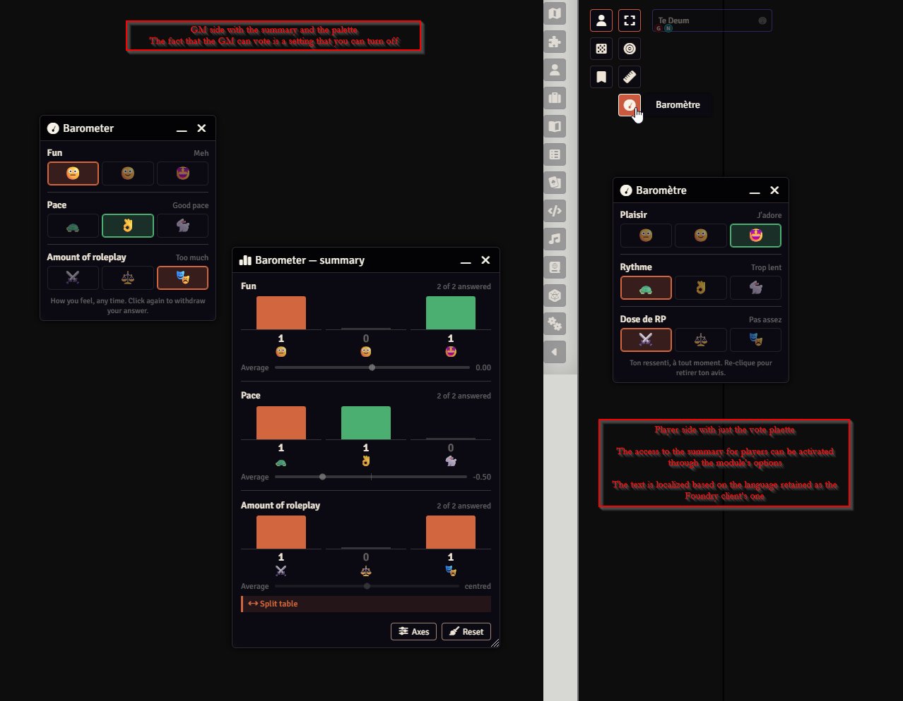
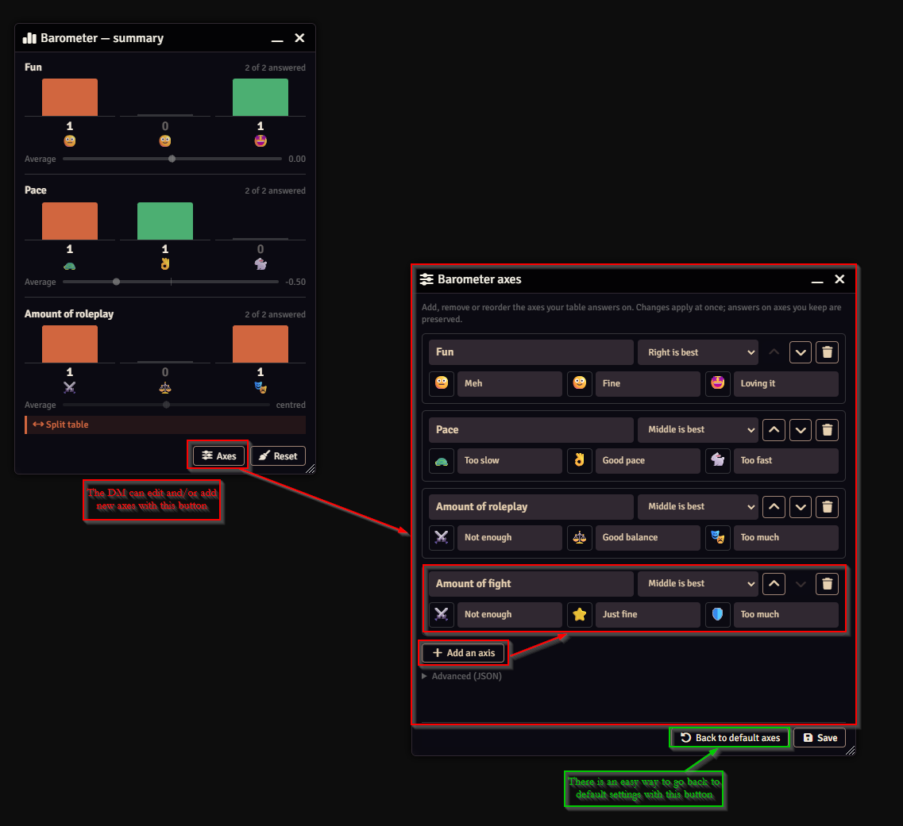

# Table Barometer

A Foundry VTT module (v13–v14).

As a GM on Foundry, without any video from my players, I sometimes wonder
whether they are having fun, how the pace of the game feels to them, and whether
there is enough RP, or too much. Rather than waiting for the end of the game to
know how they feel, I wanted a way to "take the temperature" of the table.

This module does exactly that. It is a probe that captures whatever my players
want to share with me. The summary I can consult as a GM is anonymous on screen,
so I cannot start pointing fingers at any player. And I can see the average
value as well as the distribution of "votes" (important when the players are
polarized).

The module comes with three basic axes to start with (fun, pace and amount of
RP), but it can be tailored to your needs. Only the GM can reset the barometer
or change its axes; a determined player could still skew the numbers, so it is a
mood gauge, not a ballot box. Nothing is recorded or logged.





## The three axes

| Axis | Nature | Positions |
|---|---|---|
| **Fun** | ordinal — the optimum is on the right | 😐 Meh · 🙂 Fine · 🤩 Loving it |
| **Pace** | bipolar — the optimum is in the middle | 🐢 Too slow · 👌 Good pace · 🐇 Too fast |
| **Amount of roleplay** | bipolar — the optimum is in the middle | ⚔️ Not enough · ⚖️ Good balance · 🎭 Too much |

The distinction matters. On a bipolar axis a perfectly centered average can hide
a table split down the middle. That is why the summary leads with the
**distribution**, shows the average second, and raises an explicit **Split
table** flag whenever both extremes are occupied at once.

## Install

In Foundry's setup screen: **Add-on Modules → Install Module**, paste this
manifest URL at the bottom, then **Install**:

```
https://github.com/Kantziko/table-barometer/releases/latest/download/module.json
```

Foundry will then offer updates on its own.

To install by hand instead, download `module.zip` from the
[latest release](https://github.com/Kantziko/table-barometer/releases/latest)
and unzip it as a `table-barometer` folder in your Foundry modules directory:

| OS | Path |
|---|---|
| Windows | `%localappdata%\FoundryVTT\Data\modules\` |
| macOS | `~/Library/Application Support/FoundryVTT/Data/modules/` |
| Linux | `~/.local/share/FoundryVTT/Data/modules/` |

Then, in your world: **Manage Modules** → enable *Table Barometer*.

## Use

**Players** get a floating palette: draggable, minimizable, position remembered
per client. One click sets an answer, a second click on the same position
withdraws it. Nothing is selected at first — *not set* is a state of its own,
distinct from *everything's fine* in the summary.

**The GM** gets a *Barometer — summary* button in the scene controls. A dot
lights up on it when someone has changed their mind since the last time you
looked; it goes out when you open the window. Opening it also re-polls every
connected client, in case a message went missing.

**Reset** clears everyone's answers. Do it at the start of each session.

**Axes** opens the axis editor without leaving the table. Add, remove or reorder
axes, rename them, pick an icon from the suggestions or paste any emoji. Changes
apply immediately, and answers on the axes you keep are preserved — adding a
fourth axis mid-session does not reset anyone.

## Settings

Found under **Settings ⚙ → Configure Settings → Module Settings → Table
Barometer**.

| Setting | Default | Effect |
|---|---|---|
| GM also gets the palette | off | The GM votes and counts in the summary. |
| Players may open the summary | off | Gives players the same aggregated view. |
| Minimum answers threshold | 2 (1–6) | Below this, an axis stays hidden. |
| Reveal delay | 0 s (0–300 s) | Random delay before a change reaches the GM at all. |
| Open the palette on login | on | Per-client. |
| Configure axes | — | Opens the same editor as the *Axes* button in the summary. |

Icons are plain emoji, rendered by the operating system — no asset to ship.

## Languages

The interface ships in **English** (`en`) and **French** (`fr`). Each client
sees it in the language chosen in its own Foundry settings (*Configure Settings
→ Core → Language*), and falls back to English for any other language.

**Translations wanted.** Draft translations into German, Spanish, Brazilian
Portuguese, Polish, Italian, Simplified Chinese, Japanese and Korean wait in
`translations-pending/`. They were produced with AI assistance, so they are not
shipped until a native speaker has reviewed them, as Foundry's AI content policy
requires. If you speak one of these languages, please open an issue or a pull
request: a review of 77 short strings is all it takes.

To review or add a language, start from `lang/en.json`, translate the values
only — never the keys, and keep every `{placeholder}` as is — then place the
file in `lang/` and declare it under `languages` in `module.json`. Simplified
Chinese uses the code `cn`, as Foundry's community core translation does.

The shipped axes carry translation keys, so each client reads them in their own
language. The editor shows you the translated text but keeps the key underneath:
opening it and saving changes nothing, and renaming one axis leaves the others
translatable. A label you actually type is stored as plain text and shown as-is
to everyone — which is what you want for an axis of your own.

## What this module guarantees — and what it does not

**Nothing is stored.** Nothing is written to the world database. A player's
answers live in their browser's `sessionStorage`: they survive a refresh and die
with the tab. The GM's aggregate lives in memory and vanishes on reload, then
rebuilds itself by polling connected clients. Someone who disconnects leaves the
summary immediately.

**Anonymity here is a property of the interface, not of the transport.** Three
caveats worth knowing before you promise anything to your table:

1. `game.socket.emit` broadcasts to every client. A player who opens the browser
   console and listens on the channel can read other players' named messages.
   This is true of every Foundry module of this kind.
2. The GM indexes answers by user id, so as not to count the same person twice.
   That index is never displayed, but it is in memory.
3. At a table of three, in real time, correlation is enough: a change landing
   right after a scene often identifies its author. The *reveal delay* setting
   holds each report back for a random wait before it reaches the aggregate at
   all — the alert dot and an already-open summary included — which blurs when
   a change happened without losing it. It softens the problem; it does not
   remove it.

Say so plainly to your players: this is a tool for discretion, not for secrecy.

## Security

The module adds no server-side code, opens no port, reads no file, and makes no
network request: it has no external dependency, not even a CDN. Its only contact
with Foundry is through settings and the socket.

**Destructive actions go through world settings, not the socket.** A socket
message carries no proof of who sent it, so any player could otherwise have
typed one line in the browser console to wipe the table's answers or purge every
axis. Resetting and changing the axes are therefore writes to world settings,
which the Foundry server refuses for anyone but a GM; each client then reacts to
the change. Only two messages remain on the socket — a client reporting its own
values, and a GM asking for them again — and a poll is ignored unless it names a
GM as its sender.

**Labels never become markup.** Axis and option labels are set by the GM and
displayed on every player's screen, so all of them are HTML-escaped on the way
out: a label such as `` is displayed as those very characters,
never interpreted.

**Incoming reports are filtered.** Only the values -1, 0 and 1 are kept, only
for axes that currently exist; anything else is discarded. Axis definitions are
bounded (at most 12 axes, 100-character labels) and ids matching `__proto__`,
`constructor` or `prototype` are rejected, since ids become keys of the objects
holding each participant's answers.

**What remains, and is inherent.** The socket broadcasts to every client: a
player who listens on the channel can read other people's named reports, and can
forge a report in someone else's name. Foundry provides no sender identity to a
socket listener, so this cannot be closed without an external dependency. The
consequence is bounded — a skewed barometer, no access to anything else — but it
means this is a mood gauge, not a ballot box. Do not use it for anything that
must be trustworthy.

## Layout

```
scripts/config.js        axes, validation, settings, label resolution
scripts/state.js         player sessionStorage + GM aggregate + summary maths
scripts/net.js           socket (report / poll), setting reactions, alert dot
scripts/base-app.js      shared window frame: no detach, adds minimize
scripts/player-panel.js  player palette
scripts/gm-summary.js    summary window
scripts/settings.js      settings declaration
scripts/axes-editor.js   axis editor
scripts/utils.js         HTML escaping
styles/barometer.css     palette, summary and editor styles
lang/*.json              interface strings, one file per language
translations-pending/    draft translations awaiting native review (not shipped)
docs/                    screenshots for this page (not shipped in the zip)
```

## License

MIT — see `LICENSE`.
